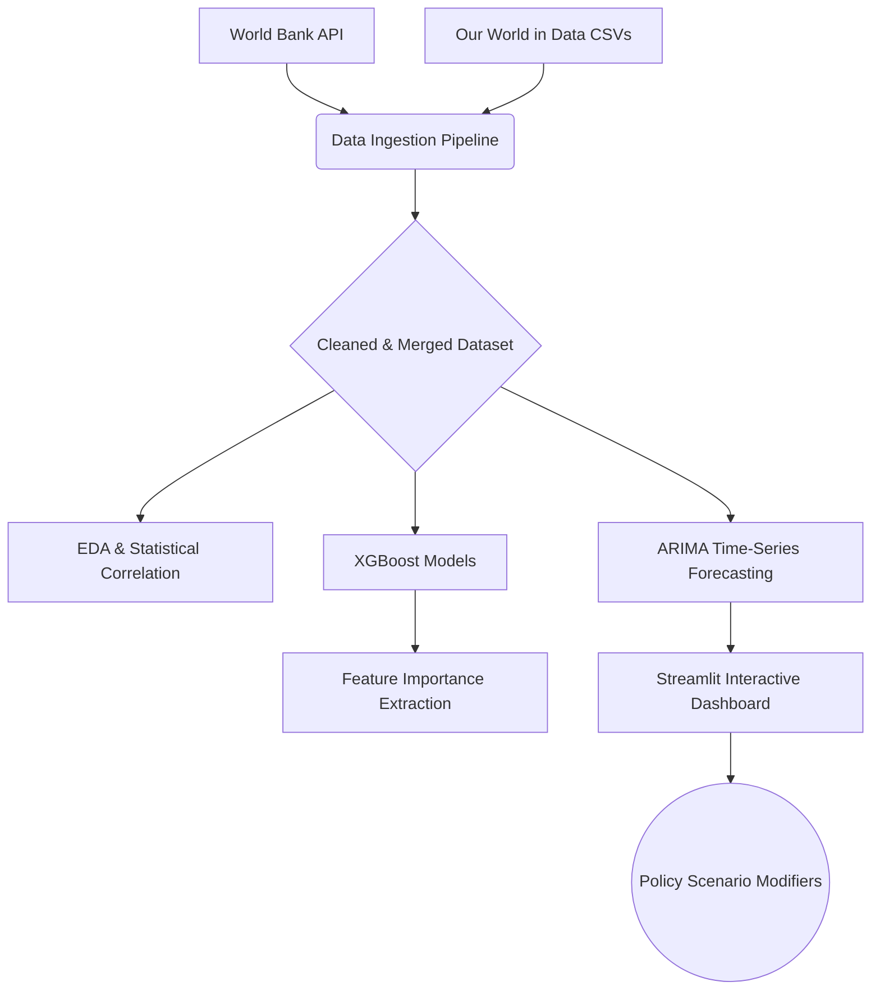

# 🌍 Global Climate Economics: 2020-2050


[](#)

## 📌 Executive Summary
**Climate Economics 2050** provides a rigorous, data-driven perspective on the macroeconomic forces propelling global carbon emissions. Leveraging over 30 years of historical data from the World Bank and Our World in Data, this project deploys Machine Learning models (XGBoost) and advanced Time-Series Forecasting (ARIMA) to predict future emissions trajectories under various climate policy scenarios out to the year 2050. It bridges the gap between economic growth (GDP), energy consumption, and environmental impact.

## 📊 Interactive Dashboard
Explore the simulated future using our fully interactive Streamlit dashboard. Adjust macro-policy levers like Carbon Taxes, Renewable Investment, and Energy Efficiency to dynamically view the compound effect on 2050 projections.

> **Note**: *Take screenshots of the local dashboard and place them in `docs/dashboard_overview.png` and `docs/forecast_scenario.png`.*
> 
> 
> 

## 🏗️ Project Architecture
The project architecture spans automated data ingestion, exploratory analytics, machine learning, and an interactive front-end.



## 🔬 Forecasting Methodology
1. **Feature Extraction**: Using XGBoost, we isolate the most statistically significant drivers of carbon emissions.
2. **Baseline Forecast**: Autoregressive Integrated Moving Average (ARIMA `(1,1,1)`) is applied to historical global trends to predict the business-as-usual trajectory to 2050.
3. **Scenario Modeling**: Policy interventions (e.g., carbon tax, EV transition) are applied as compounding year-over-year percentage modifiers to the ARIMA baseline, simulating complex macroeconomic damping effects on carbon output.

## 💡 Key Findings
1. **The Decoupling Challenge**: Primary Energy Consumption remains the #1 driver of carbon emissions and is fundamentally tied to GDP growth. True absolute decoupling has yet to be achieved globally.
2. **Business-as-Usual Crisis**: Without aggressive policy interventions, ARIMA models forecast a severe continued rise in global carbon output by 2050.
3. **Compound Policy Impact**: Singular policies (like just a Carbon Tax) are insufficient. Only a combined, compounded approach (Renewable Investment + Efficiency + Carbon Tax) successfully flattens the 2050 emissions curve.
4. **Energy Efficiency vs. Supply**: Investments in energy efficiency provide a faster reduction in the immediate curve compared to transitioning the energy supply alone, due to lag in infrastructure rollout.

## 🚀 Getting Started

### Local Installation
1. **Clone the repository** and navigate to the directory.
2. **Install dependencies**: `pip install -r requirements.txt`
3. **Run Data Ingestion**: `python src/data/ingestion.py`
4. **Launch Dashboard**: `streamlit run src/dashboard/app.py`

### Docker Deployment
```bash
docker build -t climate-economics-2050 .
docker run -p 8501:8501 climate-economics-2050
```

## ☁️ Deployment (Vercel)
While this project natively uses Streamlit, if you intend to deploy to **Vercel**, please note:
> [!WARNING]
> **Streamlit relies heavily on WebSockets**, which Vercel Serverless Functions do not support for persistent connections. Deploying Streamlit directly to Vercel will result in connection timeouts.

**Recommended Alternatives**: 
We highly recommend deploying via [Streamlit Community Cloud](https://streamlit.io/cloud) (Free) or **Render** for a smoother out-of-the-box experience.

If you must use Vercel, you will need to decouple the UI into a framework like Next.js (Vercel native) and serve the Python forecasting models as a separate FastAPI backend on Vercel Serverless.

---
*Designed for publication, academic presentation, and executive decision-making.*
